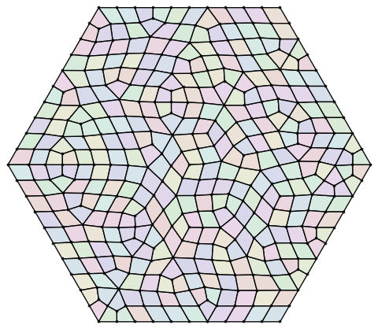
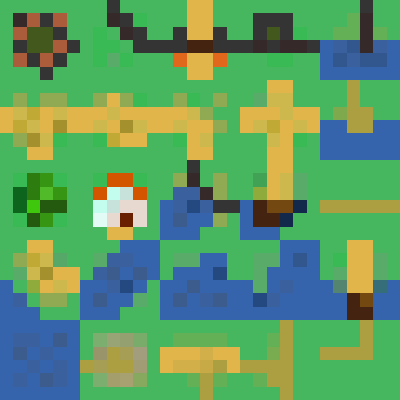
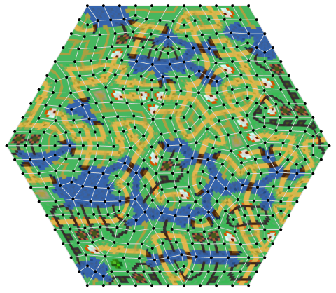
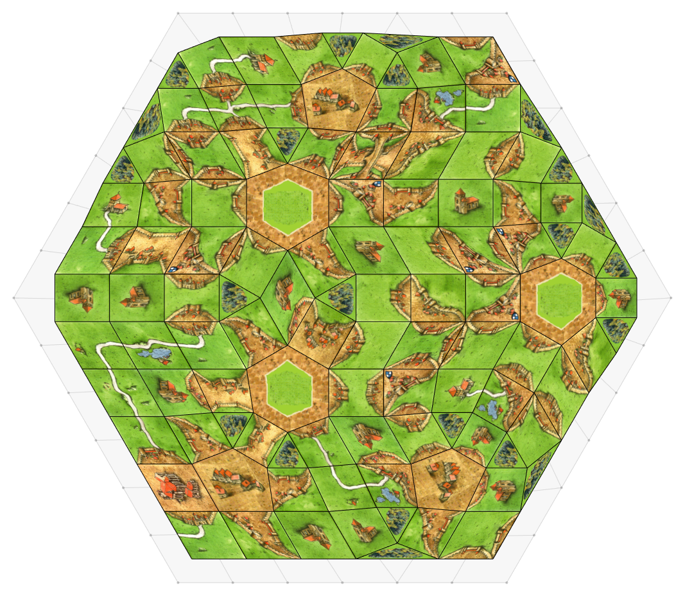

## Wave Function Collapse on Unstructured Grids

This code generates two-dimensional grids and assigns segments to its faces such that a set of neighbour conditions is fulfilled at all edges. (WFC is a special case of a SAT solver.)

This implementation is meant to be modular and instructive. These parts are easily exchangeable:
- Grid generator
- Palette of segments
- Transformations of each segment
- Solver algorithm 

#### Example 1

One of the provided generator creates a relaxed, "Townscaper"-like grid of quadrilaterals. Then, 25 segments are taken from a source palette image and possible neighbours are calculated from the edge colour values similar to https://github.com/mxgmn/WaveFunctionCollapse.
The possible transformations are chosen as the elements of the dihedral group D4 (4 rotations and reflection).

Generated grid and source image:

  
  

Result (solving time: 35 ms):

  

#### Example 2

Adding images for triangles, pentagons and hexagons to the tiles of the board game "Carcassonne", the algorithm also works on the dual grid. Here no reflections are allowed, as in the board game.
Result (solving time: 2 ms):

  

